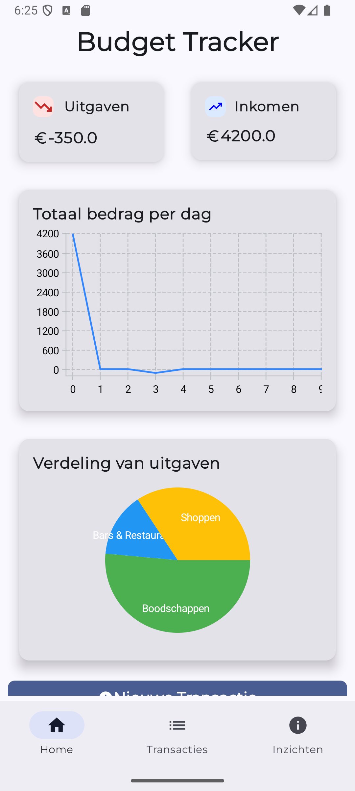
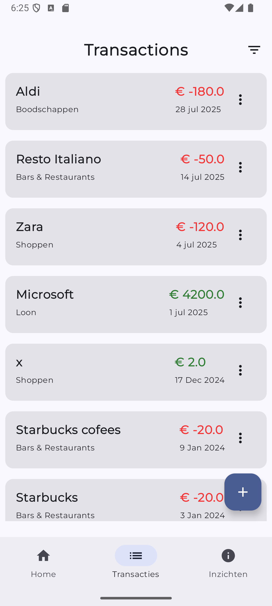
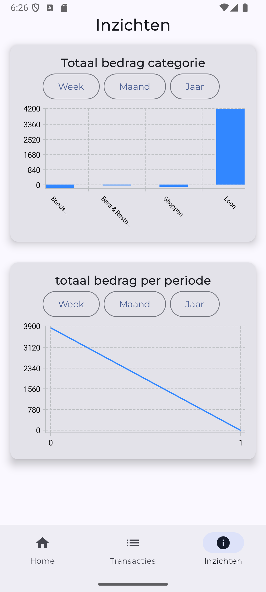

# AWM Budget Tracker v2

A modern Android budget tracking application built with Kotlin and Jetpack Compose.

## 📱 Project Overview

AWM Budget Tracker v2 is an Android application designed to help users manage their personal finances by tracking income, expenses, and budgets. The application features a clean, modern UI built with Jetpack Compose and follows Android development best practices.

## 📸 Screenshots





## 🏗️ Project Structure

```
AWM-BudgetTracker-v2/
├── app/                          # Main Android application module
│   ├── src/main/                 # Main source code
│   ├── build.gradle.kts          # App-level build configuration
│   └── proguard-rules.pro        # ProGuard configuration
├── BudgetTrackerApp/             # Secondary module/configuration
├── RESTful-API/                  # Backend API implementation
├── gradle/                       # Gradle wrapper files
├── build.gradle.kts              # Project-level build configuration
├── settings.gradle.kts           # Project settings
└── README.md                     # This file
```

## 🛠️ Tech Stack

### Android Application
- **Language**: Kotlin
- **UI Framework**: Jetpack Compose
- **Architecture**: MVVM with Android Architecture Components
- **Build System**: Gradle with Kotlin DSL
- **Minimum SDK**: 24 (Android 7.0)
- **Target SDK**: 34 (Android 14)

### Key Dependencies
- **Compose BOM**: 2024.04.01
- **Core KTX**: 1.16.0
- **Activity Compose**: 1.10.1
- **Navigation Compose**: 2.8.9
- **Material 3**: Latest
- **Lifecycle**: 2.8.7

### Testing
- **JUnit**: 4.13.2
- **Espresso**: 3.6.1
- **Android Test**: 1.2.1

## 🚀 Features

- Modern Material Design 3 UI
- Responsive layout with Jetpack Compose
- Navigation between different screens
- Budget tracking and management
- Expense categorization
- Data persistence
- RESTful API integration

## 📂 Module Details

### Main App Module (`/app`)
Contains the primary Android application code including:
- Activities and Composables
- ViewModels and business logic
- Data models and repositories
- Resources (layouts, strings, themes)

### RESTful API Module (`/RESTful-API`)
Backend API implementation for the budget tracker application.

### BudgetTrackerApp Module (`/BudgetTrackerApp`)
Additional configuration or modular components for the application.

## 🎨 UI/UX Design

The application uses Material Design 3 principles with:
- Adaptive color schemes
- Dynamic theming support
- Responsive layouts for different screen sizes
- Intuitive navigation patterns
- Accessibility features

## 📝 Code Style

This project follows:
- [Kotlin coding conventions](https://kotlinlang.org/docs/coding-conventions.html)
- [Android Kotlin style guide](https://developer.android.com/kotlin/style-guide)
- Material Design guidelines

## 📄 License

This project is licensed under the MIT License - see the [LICENSE](LICENCE.txt) file for details.

## 👥 Authors

- **Erhan Manav** - [Github](https://github.com/Erhan99)
- **Jorne Van Gils** - [Github](https://github.com/JorneVG)
